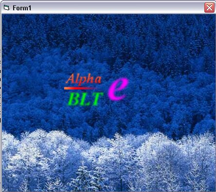



## Alpha blending with alpha mask

### Description

32bit Alpha blending with alpha-translucent mask, very fast. Compile for full speed.
 
### More Info
 

             |
---                |---
**Submitted On**   |2003-01-13 00:24:38
**By**             |[Tecc](https://github.com/Planet-Source-Code/PSCIndex/blob/master/ByAuthor/tecc.md)
**Level**          |Advanced
**User Rating**    |4.7 (28 globes from 6 users)
**Compatibility**  |VB 6\.0
**Category**       |[Graphics](https://github.com/Planet-Source-Code/PSCIndex/blob/master/ByCategory/graphics__1-46.md)
**World**          |[Visual Basic](https://github.com/Planet-Source-Code/PSCIndex/blob/master/ByWorld/visual-basic.md)
**Archive File**   |[Alpha\_blen1580864292003\.zip](https://github.com/Planet-Source-Code/tecc-alpha-blending-with-alpha-mask__1-45118/archive/master.zip)

